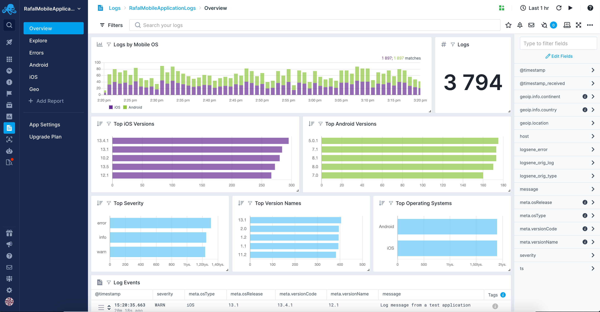
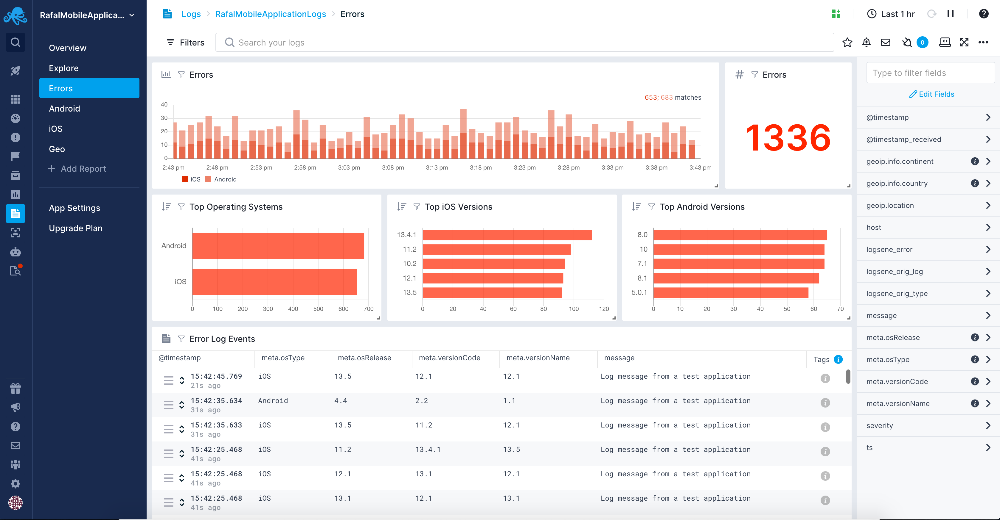
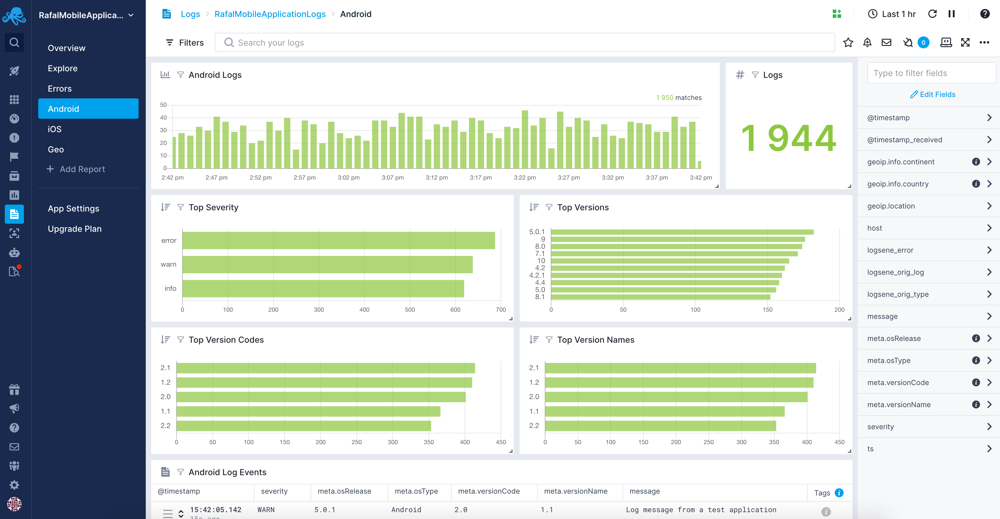

[logsene]: https://sematext.com/logsene/
[register]: https://apps.sematext.com/ui/registration
[hosted-kibana]: https://sematext.com/docs/logs/kibana/
[video-tutorials]: https://www.elastic.co/blog/kibana-4-video-tutorials-part-1

SDK for Shipping Android Application Logs to Sematext
==========================================================

[](https://jitpack.io/#sematext/sematext-logsene-android)
[](https://img.shields.io/github/license/sematext/sematext-logsene-android.svg)

[Sematext Logs is ELK as a Service][logsene]. This library lets you collect **mobile analytics** and **log data** from your Android applications using Sematext. There is an equivalent library for [shipping logs from iOS](https://github.com/sematext/sematext-logsene-ios) available.  If you don't have a Sematext account, you can [register for free][register] to get your [App](https://sematext.com/docs/guide/app-guide/) token.

Use the **Mobile Application Logs** Integration to get out-of-the-box reports with the most important information about your mobile applications.

Get an overview of your mobile apps with information like:
 - top Android versions
 - top log severities and version names



Explore the common errors associated with your mobile applications and see an aggregated error view including:
 - number of errors and theirs count over time
 - top operating systems, top Android versions that are reporting errors
 - error log events



Get insights from dedicated Android report that include:
 - mobile operating system logs count histogram and their count
 - top severities, versions, version codes, and version names
 - mobile applications log events



Getting Started
===============

If you haven't already, register for a free account. Create a new Logs App to get the App token, you will need it later.

Add the following gradle dependency to your Android application:

```
allprojects {
 repositories {
    mavenCentral()
    maven { url "https://jitpack.io" }
 }
}

dependencies {
    compile 'com.github.sematext:sematext-logsene-android:3.2.0'
}
```

The library sends data to Sematext servers, so you will need to add the `INTERNET` and `ACCESS_NETWORK_STATE` permissions to your application manifest.

```xml
<uses-permission android:name="android.permission.INTERNET"></uses-permission>
<uses-permission android:name="android.permission.ACCESS_NETWORK_STATE"></uses-permission>
```

The library sends data in batches to preserve battery (every 15 minutes), or if
there are more than 10 events queued up. Events are saved while the device is
offline so you don't have to worry about losing any data. By default the
library keeps up to 5,000 events while offline.

Add the following inside the application manifest (inside `<application>`):

```xml
 <meta-data
   android:name="LogseneAppToken"
   android:value="yourtoken" />
 <meta-data
   android:name="LogseneType"
   android:value="example" />

 <!-- For EU region use https://logsene-receiver.eu.sematext.com as the receiverUrl -->
 <meta-data
   android:name="LogseneReceiverUrl"
   android:value="https://logsene-receiver.sematext.com" />
```

 * **LogseneAppToken (required)**: This is your Logs App token, you should have received one after registering and creating your Logs App. We **highly recommend** creating a write-only token in your app settings to prevent any unauthorized access to your logs.
 * **LogseneType (required)**: Type to be used for all events (Sematext Logs uses Elasticsearch compatible API)
 * **LogseneMaxOfflineMessages**: Maximum number of offline stored events. Events are stored on the device while it's offline, or if the library is unable to send them to Sematext for some reason.
 * **LogseneReceiverUrl**: If you are using Sematext Cloud US region use https://logsene-receiver.sematext.com. For EU region use https://logsene-receiver.eu.sematext.com as the `receiverUrl`.
 * **LogseneMinTimeDelay**: Minimum amount of time (in milliseconds) to wait between sending logs while application is running and creating new log messages
 * **LogseneInterval**: time interval (in milliseconds) for sending logs regardless of app being active (minimum 15 minutes)
 * **LogseneRequiresUnmeteredNetwork**: if logs should be shipped only on unmetered network connection
 * **LogseneRequiresDeviceIdle**: if logs should be shipped only when device is idle
 * **LogseneRequiresBatteryNotLow**: if logs should be shipped only when battery is not low
 * **LogseneAutomaticLocationEnabled**: if logs should be automatically enriched with device location information. See the **Enriching Logs with Location** section for more details.

Example Application
-------------------

To see how some basic use cases are actually implemented, checkout the bundled `TestApp` android application. Make sure to set your own App token in the Android manifest.

**Note** that it's highly recommended that you use one instance of Logsene at any time in your app.

Initializing Logsene
--------------------

Starting with version **3.0.0** of the Android library `Logsene` needs to be initialized in a **static** way in order to be used. This allows usage in classes that don't have `Context` available. To do that, you need to call the following in your application code. Keep in mind this is only needed **once**:

```java
Logsene.init(this);
```

To get the instance of the `Logsene` object that supports logging you need to call the `getInstance()` method, for example:

```java
Logsene logsene = Logsene.getInstance();
logsene.info("Hello World!");
```

Mobile Application Analytics
----------------------------

Once you've setup the Logsene service, it's trivial to start sending custom events. For example, you may want to send an event every time a user starts an activity. In that case you could put the following inside the `onCreate()` method:

```java
try {
    JSONObject event = new JSONObject();
    event.put("activity", this.getClass().getSimpleName());
    event.put("action", "started");
    Logsene logsene = Logsene.getInstance();
    logsene.event(event);
} catch (JSONException e) {
    Log.e("myapp", "Unable to construct json", e);
}
```

To visualize the collected data use [Sematext dashboards](https://sematext.com/docs/dashboards/).

If you don't see the events in the dashboard immediately, note that data are sent in batches to preserve the battery (every 60s), or if there are more than 10 events queued up. Events are saved while the device is offline, so you don't have to worry about losing any data.

When it comes to the structure of your events, you are free to choose your own, the above is just an example. You can use any number of fields, and you can use nested fields. Basically, any valid JSON object will work fine. Note that the `meta` field is reserved for meta information (see [Meta Fields](#meta-fields) below). If you set a value for this field when sending an event, the meta information will not be included for that event.

Meta Fields
-----------

Meta data are added to each event, all stored within the "meta" field:

 * versionName (as defined in your build.gradle)
 * versionCode (as defined in your build.gradle)
 * osRelease (android version)
 * uuid (unique identifier for this app installation)

You can set your own meta fields with `Logsene.setDefaultMeta()`. For example:

```java
try {
    JSONObject meta = new JSONObject();
    meta.put("user", "user@example.com");
    Logsene.setDefaultMeta(meta);
} catch (JSONException e) {
    Log.e("myapp", "Unable to construct json", e);
}
```

Note that these meta fields are global, and will be attached to every event sent to Sematext.

Pausing & Resuming Logs Sending
-------------------------------

The library can be instructed to stop sending logs on demand. To do that you need to call the following function:

```java
logsene.pause();
```

Logs sending can be resumed by calling the following function:

```java
logsene.resume();
```

Note that the logs that are in the buffer and were waiting to be sent at the time of pausing will not be sent until the logs sending process is resumed. 


Centralized Logging
-------------------

The library offers some basic functions for centralized logging:

- `Logsene.debug(String)`
- `Logsene.info(String)`
- `Logsene.warn(String)`
- `Logsene.warn(Throwable)`
- `Logsene.error(String)`
- `Logsene.error(Throwable)`

For integrating with existing logging frameworks, see below.

Enriching Logs with Location
----------------------------

Logs can be enriched with location data manually and automatically. For manual enriching the library supports the following methods:

- `Logsene.debug(String, Double, Double)`
- `Logsene.info(String, Double, Double)`
- `Logsene.warn(String, Double, Double)`
- `Logsene.warn(Throwable, Double, Double)`
- `Logsene.error(String, Double, Double)`
- `Logsene.error(Throwable, Double, Double)`

For example:

```
logsene.info("Hello World with Location!", 53.08, 23.08);
```

It is also possible to tell the library to automatically retrieve location from the device. In such case the `Logsene` object instance needs to be created in the following way:

```
Logsene.init(this);
Logsene logsene = Logsene.getInstance();
logsene.initializeLocationListener(context);
```

Because of the automatic retrieval of location from the device the `ACCESS_COARSE_LOCATION` and `ACCESS_FINE_LOCATION` permissions are needed:

```
<uses-permission android:name="android.permission.ACCESS_COARSE_LOCATION"></uses-permission>
<uses-permission android:name="android.permission.ACCESS_FINE_LOCATION"></uses-permission>
```

It is also crucial to call the `initializeLocationListener(Context context)` method of the `Logsene` object after the user gives the application the permission to use location data. Otherwise it will not work. Example on how that can be done is included in the `com.sematext.logseneandroid.MainActivity` class.

### JUL

If your application uses JUL (java.util.logging) loggers, you can use the provided custom Handler for Logsene. You will need to configure it through code, since we need a reference to the `Context` object. If you configure your loggers to use the `LogseneHandler`, all log messages will be sent to Sematext for centralized logging.

```java
Logsene.init(this);
Logsene logsene = Logsene.getInstance();
Logger logger = Logger.getLogger("mylogger");
logger.addHandler(new LogseneHandler(logsene));
```

### Using this SDK with Timber and Timber.Tree

Timber is a logger with a small, extensible API which provides utility on top of Android's normal Log class.  To use Timber with this SDK for shipping Android logs to Sematext have a look at https://github.com/JakeWharton/timber/blob/master/timber-sample/src/main/java/com/example/timber/ExampleApp.java. You can extend `Timber.Tree` and overwrite the log method and include logging using the `Logsene` object there. Simply initialize the `Logsene` object in the `onCreate` method and everything should work from that point.

### Logging exceptions

If you use JUL and the `LogseneHandler`, all logged exceptions will be sent to Sematext, no further configuration is needed. However, if you don't use JUL, the library provides a helper method to log exceptions:

```java
Logsene.init(this);
Logsene logsene = Logsene.getInstance();
try {
    trySomeOperation();
} catch (IOException e) {
    logsene.error(e);
}
```

### How to log uncaught exceptions (crashes)

You can log any uncaught exceptions by defining your own uncaught exception handler. You will need to define a custom `Application` class for this to work. For example:

```java
public class TestApplication extends Application {
    private Thread.UncaughtExceptionHandler defaultExceptionHandler;
    private Thread.UncaughtExceptionHandler exceptionHandler = new Thread.UncaughtExceptionHandler() {
        @Override
        public void uncaughtException(Thread thread, Throwable ex) {
            // Send uncaught exception to Logsene.
            Logsene.init(TestApplication.this);
            Logsene logsene = Logsene.getInstance();
            logsene.error(ex);

            // Run the default android handler if one is set
            if (defaultExceptionHandler != null) {
                defaultExceptionHandler.uncaughtException(thread, ex);
            }
        }
    };

    public TestApplication() {
        defaultExceptionHandler = Thread.getDefaultUncaughtExceptionHandler();
        Thread.setDefaultUncaughtExceptionHandler(exceptionHandler);
    }
}
```

Don't forget to declare the custom application class in your manifest (with `android:name` on `application` element).

Migrating to version 3.1 from previous versions
-----------------------------------------------

Starting from version **3.1.0** Logsene Android SDK is no longer displaying the prompt to enable location services and provide appropriate rights. It is now the responsibility of the application itself.

Migrating to version 3.x from 2.x
---------------------------------

Starting from version **3.0.0** Logsene Android SDK contains backwards incompatible changes related to how it is initialized. You no longer need to create the `Logsene` object everytime you would like to use it for logging. You no longer create the `Logsene` object itself like this:

```java
Logsene logsene = new Logsene(context, true);
```

Instead you call the `init(Context)` method once and retrieve the instance of `Logsene` object later:

```java
Logsene.init(context);
Logsene logsene = Logsene.getInstance();
```

You also need to include the `LogseneAutomaticLocationEnabled` property in your manifest file to enable automatic log enrichment with location data:

```xml
<meta-data
    android:name="LogseneAutomaticLocationEnabled"
    android:value="true" />
```
